## Introduction

This summer I have the opportunity to work on a project related to machine learning.

In short: My work is to find out whether it is feasible to replace a huge table of data with a Neural Network. The final solution should use less space on silicon than the existing one.

The current milestones look like this:

- Find Neural Network architecture
- Prepare the training data
- Train the Neural Network
- Evaluate the training process
- Quantize the Neural Network
- Make a C reference implementation
- Implement the Model in Hardware
- Profit ???

I will add to this blog post in the course of the next weeks.

## Training Data

I received the two tables in excel and promptly converted them to the .csv format.

Reading and plotting them via matplotlib gives me this:

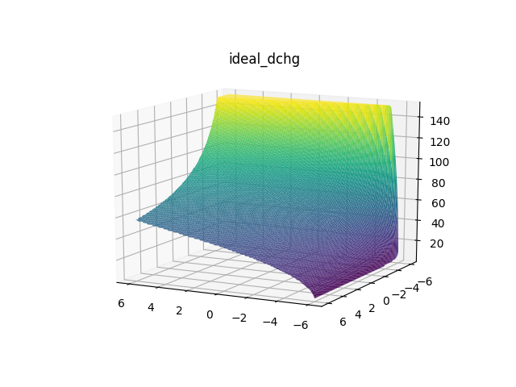
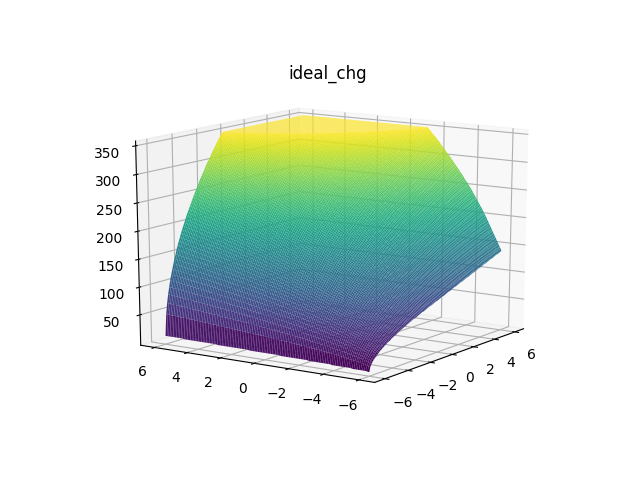

These two functions represent the ideal curves. For the sake of simplicity I will train the neural networks with these two, and after that go on to the real value ones.

In this particular project, it doesn't matter wether the network is overfitting, as the training data is everything the network will ever see.
That means we use all of the Data as Training Data and none for Validation.

The network will only be fed input from this data, therefore it doesn't have to generalize. Yet one requirement is that the project uses as few parameters as possible - and to achieve this it has to generalize after all.

## The Architecture

The main restriction of this project is that the network should be implemented in hardware. That means costly activation functions and network structures should be omitted.

After a short research I came to the conclusion that a normal feed forward network with the ReLu activation function is the way to go.

# ReLu Activation Function

The ReLu (rectified linear unit) can be described as:
>f(x)= max(0, x)

A picture is worth a thousand words:

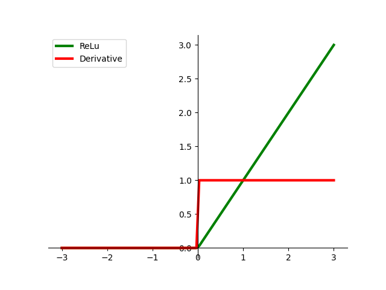

Despite its simplicity the rectifier is a non linear activation function and therefore the right choice for this project.

"The rectifier is, as of 2017, the most popular activation function for deep neural networks."
[wikipedia](https://en.wikipedia.org/wiki/Rectifier_\(neural_networks\) "ReLu")

## Training The Neural Network

For this project I use the [Tensorflow](https://www.tensorflow.org/ "Tensorflow") API in major version 2 to train, infer and quantise the Neural Network, as I have previous experience with it already.
And yet it is my first time to use the Keras backend. But I have to say it is pleasant to use and setup.

After setting everything up training the network wasn't too hard to do, as I don't have to pay attention to overfitting.

When the training is done I compare the Training Data with the output of the neural network to ensure everything is correct. Sometimes the network fails to converge, I have to take a look how to prevent that. (LeakyReLU?)

>Model: "ReluNetwork"
>
>---
>Layer (type) &nbsp;&nbsp;&nbsp;&nbsp;&nbsp;&nbsp;&nbsp;&nbsp;&nbsp;&nbsp;&nbsp;&nbsp; Output Shape &nbsp;&nbsp;&nbsp; Param    
>dense\_0 (Dense) &nbsp;&nbsp;&nbsp; multiple &nbsp;&nbsp;&nbsp;&nbsp;&nbsp;&nbsp;&nbsp;&nbsp;&nbsp;&nbsp;&nbsp;&nbsp;&nbsp; 48        
>dense\_1 (Dense) &nbsp; &nbsp;&nbsp; multiple &nbsp;&nbsp;&nbsp;&nbsp;&nbsp;&nbsp;&nbsp;&nbsp;&nbsp;&nbsp;&nbsp;&nbsp;&nbsp; 272       
>prediction (Dense) &nbsp;&nbsp; multiple &nbsp;&nbsp;&nbsp;&nbsp;&nbsp;&nbsp;&nbsp;&nbsp;&nbsp;&nbsp;&nbsp;&nbsp;&nbsp; 17        
>
>---
>
>Total params: 337  
>Trainable params: 337  
>Non-trainable params: 0

### Discharge Training Data

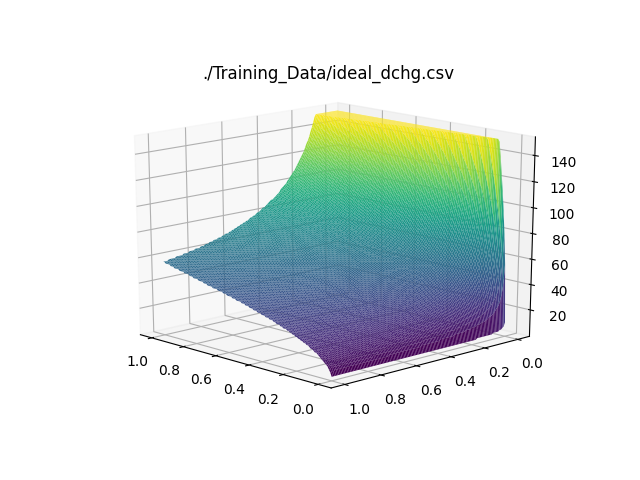
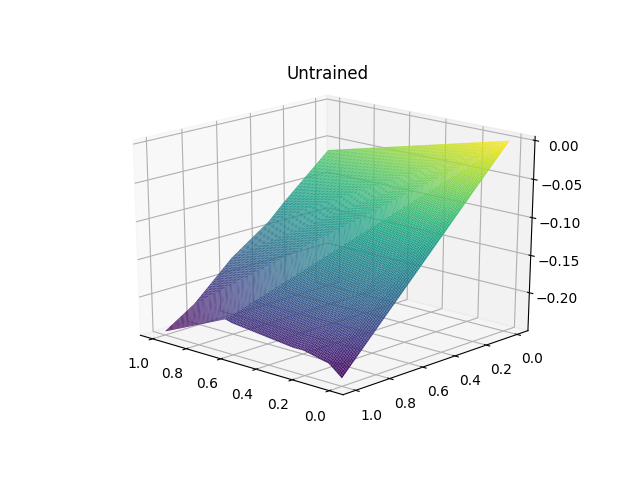
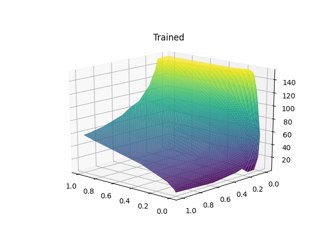

### Charge Training Data

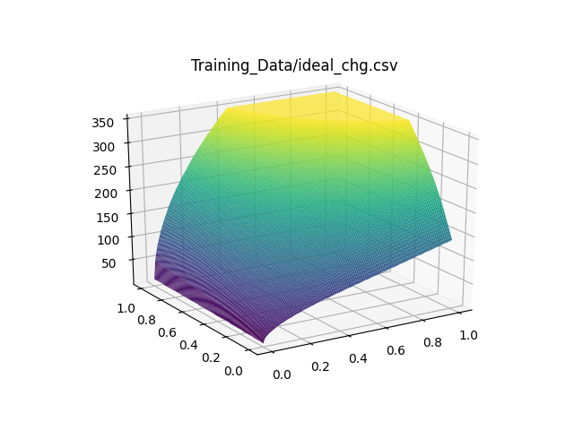
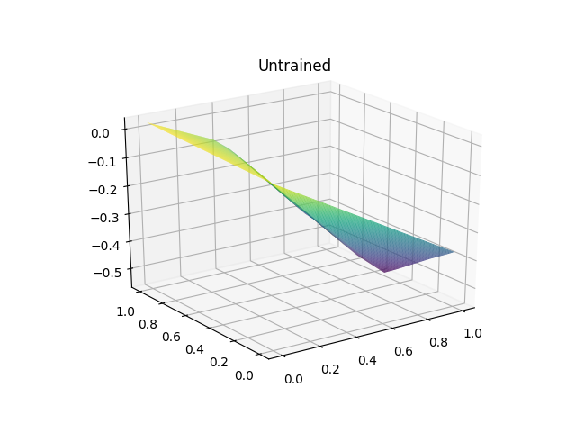
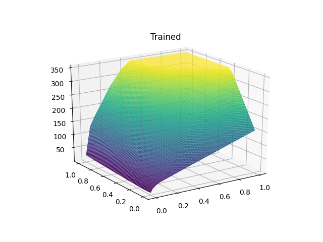

Of course: By increasing the parameters the model will be more accurate, I have to find a middle way.

During training different metrics are saved to be viewed via Tensorboard.

## Testing Different Configurations 1

To find the best possible combination of layer size and neurons per layer I wrote a script which tries out different combinations of networks, trains them and saves the result as a .csv file.

Click [here](./table_0.html) to access the table. You can order the different columns 

It took around 1 hour to run all of these combinations. Another advantage is, that I can now test for regressions in the training process.

Multiple training sessions look like this:

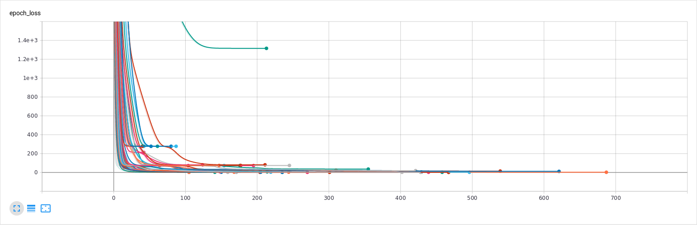

More interesting with a logarithmic scale:

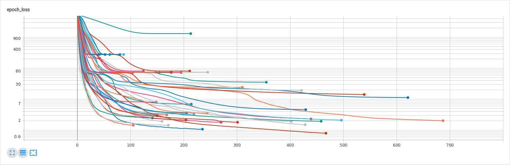

With the information from this table I changed my training script again and measured even more values. This time for less combinations, as I now know which ones certainly don't lead somewhere.

This time it took around 12 minutes to run the whole thing.

It did the test two times, because the first time two configurations failed to properly train and stopped too early. Mabye I should increase the patience on the early-stopping callback.

You can get the first test [here](./table_1.html).
And the second one [here](./table_2.html).

I now have a general idea of what the network architecture should look like.

## Reference Implementation in Python

To actually implement the network in hardware I have to fully understand the implementation in Tensorflow. I decided the best way to do this is to write a reference implementation in pure Python - no Tensorflow. 

First the network is trained in Tensorflow until I'm satisified with the performance. The weights are now what actually defines the network (and the architecture of course). So I had to find a way to export them. I decided to extract the weights of every layer on my own and summarize them in a .json file. 

You can have a look at one [here](./network.json).

The file describes a two layer network with 4 neurons in the first layer and 1 neuron in the last layer.
I didn't export any information on the activation function, but we know every Layer but the last one is ReLu and the last Layer Linear.

With the network imported in Python I started making classes for the Network, Layer and Neuron.

The main operation is implemented as:

> self.result = self.activation_function(np.dot(values, self.weights) + self.bias)

And after some bug fixes I got the same results as when running in Tensorflow (even with larger networks).

But this was the easy part. What's missing is the quantization of the network. To efficiently implement the network in hardware it must use integers for calculating.

## Quantization Part 1

When it comes to quantization you have two choices:

- Post-training quantization
- Quantization aware training

Quantizing networks can lead to accuracy loss, especially in smaller networks. To reduce this impact it is better to train the network quantization aware: A fake quantization is added, but the weights are all still float32.

I did that, but now I have no idea how to use these additional weights for quantizing in my reference implementation. Hell I don't even know what my network looks like.

And after converting to the tflite format, I didn't find a way to display my graph in Tensorflow (there sure is one). But then I found Netron.

## Netron

*"Netron is a viewer for neural network, deep learning and machine learning models."*

What that means is, that it can read all the common formats used in various machine learning frameworks - and that's a lot.

> Netron supports ONNX (.onnx, .pb, .pbtxt), Keras (.h5, .keras), Core ML (.mlmodel), Caffe (.caffemodel, .prototxt), Caffe2 (predict_net.pb), Darknet (.cfg), MXNet (.model, -symbol.json), Barracuda (.nn), ncnn (.param), Tengine (.tmfile), TNN (.tnnproto), UFF (.uff) and TensorFlow Lite (.tflite).

> Netron has experimental support for TorchScript (.pt, .pth), PyTorch (.pt, .pth), Torch (.t7), Arm NN (.armnn), BigDL (.bigdl, .model), Chainer (.npz, .h5), CNTK (.model, .cntk), Deeplearning4j (.zip), MediaPipe (.pbtxt), ML.NET (.zip), MNN (.mnn), PaddlePaddle (.zip, __model__), OpenVINO (.xml), scikit-learn (.pkl), TensorFlow.js (model.json, .pb) and TensorFlow (.pb, .meta, .pbtxt, .ckpt, .index).

Now I can display the graph of my quantization aware model:

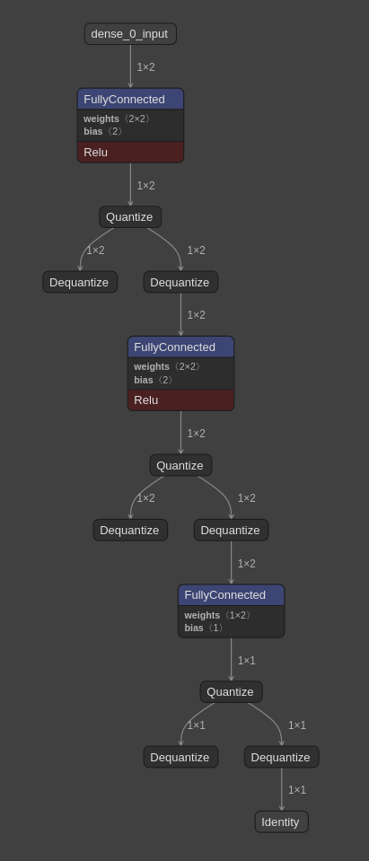

I can even see, that the variables and weights are in float32:

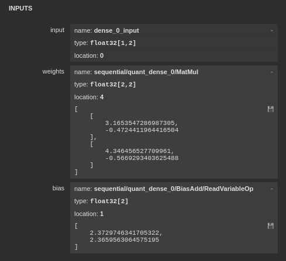

## Optimizations

A difference graph can show areas where the network is unable to properly reproduce the training data.

Here is the difference for the discharge training data:

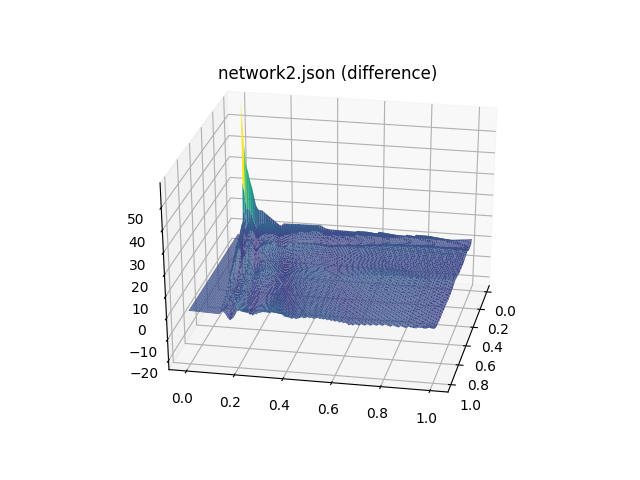

As you can see the network has especially problems during transitioning to the saturation of the graph. And as it seems in one corner, where the curve is very steep.

And here for the charge training data:

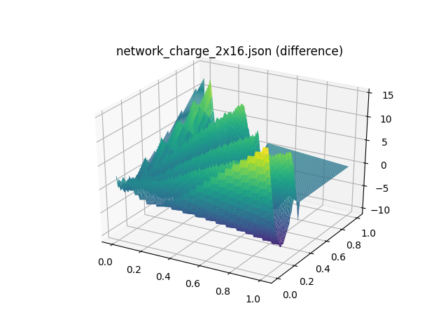

The training data has a very smooth curve, which the relu network isn't that good at reproducing.

As the saturated part of the curve doesn't give us more information than "I'm saturated" I could try to omit those values during training and clamp the output to that value. Theoretically the curve should continously increase at that position, which maybe is easier to reproduce for the Neural Network.

### Removing Saturated Values

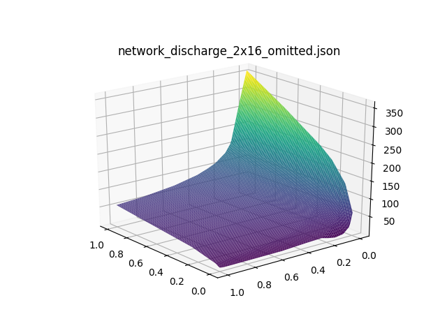

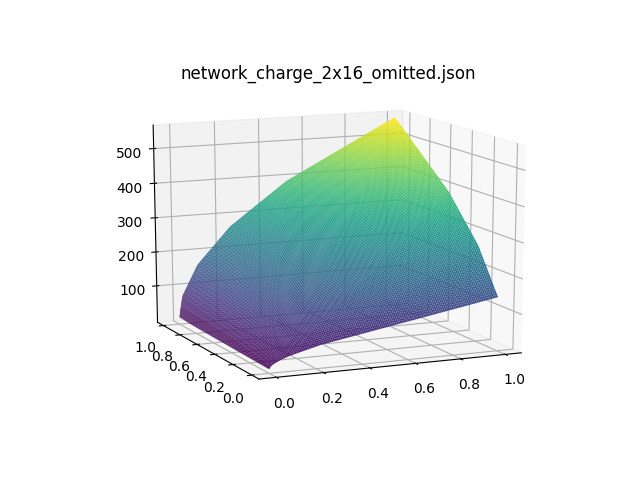

We see that the output of the network is not cut of, which could lead to a better performance. However for measuring the metrics the output of the Neural Network is clamped.

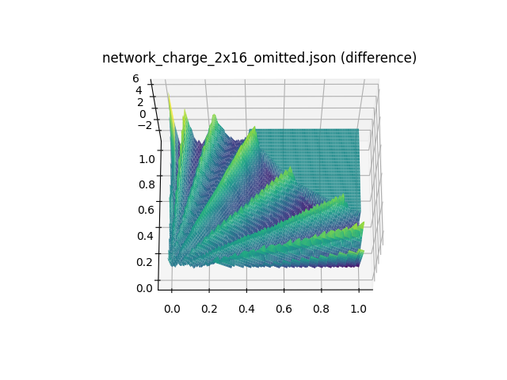

The difference graph looks almost the same,without the distortion from the transition to the saturated values. But what we actually wanted to know: Is the graph represented more accurately, i.e is the error smaller?

Before:

>Summary:  
Mean Square Error:      9.121655632625213  
Root Mean Square Error: 3.020207879041642  
Mean Absolute Error:    2.102340043584315  
R2 Coefficient:    0.999073678306707

After:

>Summary:  
Mean Square Error:      1.4681467599118379  
Root Mean Square Error: 1.2116710609368526  
Mean Absolute Error:    0.879898674514405  
R2 Coefficient:    0.999850906869606 

The answer is: Yes!

---
Read the next part [here](../2020_08_10/entry.html).