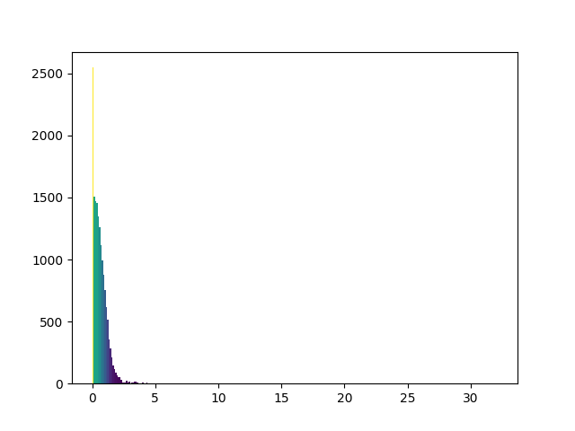

## Introduction

This is the second part of my series about the work I do on this years internship.
If you haven't already, you can read the first part [here](../2020_08_03/entry.html).

## Testing Different Configurations 2

There are many different training techniques and network architectures that could lead to a performance improvement. So once again these things must be tested, namely pooling layers, leaky ReLus and different sizes of networks.

I decided to define the network architectures in an array and loop after one another:

> configurations = [  
	[16, 16, 1],  
	[16, 'pa', 16, 1],  
	[16, 'pm', 16, 1],  
	[14, 14, 1],  
	[14, 'pa', 14, 1],  
	[14, 'pm', 14, 1]  
]

Here the numbers stand for *neurons\_per\_layer* and *'pa'* for pooling average and *'pm'* for pooling maximum. Very ingenious.

I now have a global configuration used for all networks:

> global\_configuration = {  
	'training\_data\_path' : '../TrainingData/ideal\_dchg.csv',  
	'omit\_saturated\_values' : True,  
	'batch\_size' : 64,  
	'num\_epochs' : 500,  
	'early\_stopping' : False,  
	'patience' : 8,  
	'num\_iterations\_per\_config' : 3,  
	'leaky\_relu' : True  
}

And a local one where I only test specific features.

You can get a test summary [here](table_3.html).

## Two Path Network

Since the two input variables influence the output curve independently to a certain extent, this can lead to better performance when both are processed alone for a short path.

It should look like this, of course with varying size:

But as you can see in this [table](summary_twoPathNetwork_5_iterations.html), this techique doesn't provide a benefit when compared to other networks with similiar weight count. The reason for this could be, that in a fully connected network the training process would connect both variables the best way anyway. 

By doing it this way we give this process restrictions: *You can only use these weights for that input.*

So either there are to little or too much weights, it's hard to meet the middle.
Of course, there may be weights in the fully connected network that have little effect on the output. But these can be removed during the quantization process.

## Histogram Visualization

A histogram shows us how data is distributed - in this case the error of the prediction.

For this application it was interesting to see if there would be a location where the errors are concentrated, which it does not appear to be the case.

The histogram is plotted via matplotlib and colored depending on frequency.

We can even have a more detailed look:

... and compare it to a network with less weights:

## Quantization Part 2

### Fixed Point Arithmetics

The idea is to implement the neural network with fixed point arithmetic in order to reduce the total cost of resources.

So I took the python implementation of the Neural Network and replaced all floats with fixed-point numbers. I used the [spfpm](https://pypi.org/project/spfpm/) python module for this. I decidid to run some tests on how the network performs under these constraints.

First I tried to use one fixed-point format for every layer, this means we can share the information about where the decimal point.

Suppose we got the greatest absolute weight of *5.234234andsoon* in this layer.

To represent the integer part (5) we need 3 bits + 1 bit for the sign.
If we decide to use 1 Byte as storage for the weights that means there are 8 - 4 = 4 bits left for the fractional part.

The error distribution for this case looks like this:

Now what if in one layer there is only one very high weight of *18.21412andsoon*.
This means we need 6 bits for the integer part and have only 2 left for the fractional.
Now, if most of the other weights are around the value **1.andsoon* which would only need 2 bits for the integer part, we essentially loose the rest of the bits, as the format has to be the same.

But if we only cast the weights of every neuron in the same format, it is more unlikely to have huge differences in the weight values - and therefore the error is reduced:

We can take this one step further and cast every weight on their own, but this means we have to store for every weight the coresponding information for the decimal point.

Of course the error would hugely decrease:

The same thing counts with the other training set.

Layers:

Neurons:

Weights:

### Failures

What successful quantization should **not** look like:

That happens when there are not enough bits for the fractional part of the fixed point number, therefore the resolution is suffering.

---
Read the next part [here](../2020_08_17/entry.html).