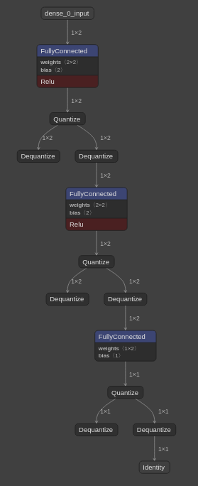
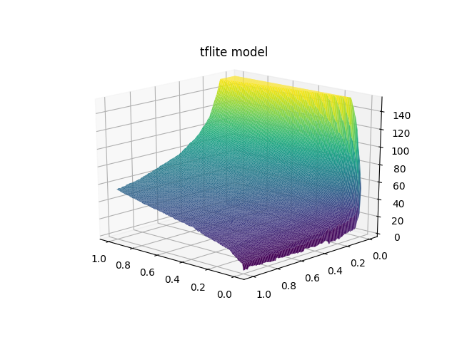
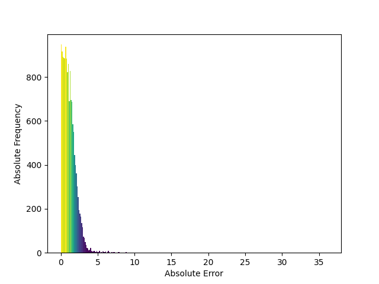
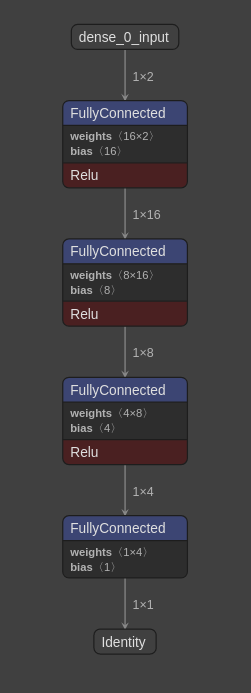
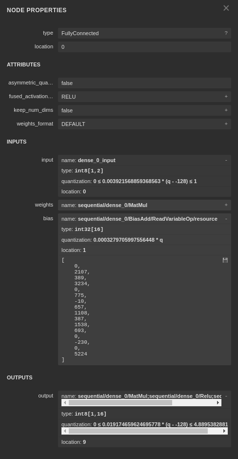
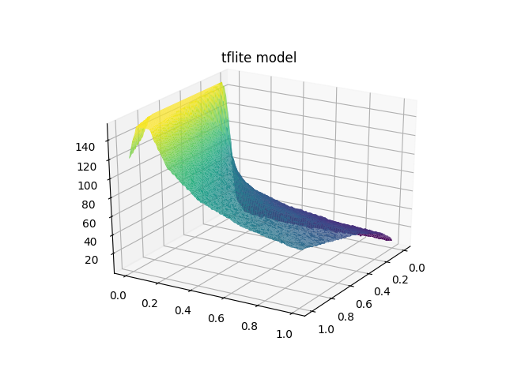

## Introduction

This is the third part of my series about the work I do on this years internship.
If you haven't already, you can read the second part [here](../2020_08_10/entry.html).

We decided to use the Tensorflow quantization scheme, as it apparently gives us better results.
And we can use the Quantization Framework included in Tensorflow.

But first of all I had to understand the quantization scheme.

## Quantization Scheme

The quantization scheme for TFLite is described [here](https://www.tensorflow.org/lite/performance/quantization_spec) based on this paper: [arXiv:1712.05877](https://arxiv.org/abs/1712.05877). Direct [Download](https://openaccess.thecvf.com/content_cvpr_2018/papers/Jacob_Quantization_and_Training_CVPR_2018_paper.pdf)

So I decided to write a small reference implementation in C, because for me bit exact arithmetic is easier to implement in C than in Python.

After a successful run (and after mostly understanding everything) I started looking into the quantization in Tensorflow.

## TFLite Quantization

As already said in previous posts there are basically two types of quantization:

- Post-training quantization
- Quantization aware training

While post training quantization is more easily to use (you just take a pretrained model, give the converter some representative input samples ... and you have a quantized network), it is less accurate than the second approach.

So naturally I decided for quantization aware training.

### Quantization Aware Training

How does it work? Define a model, train it on the training data, convert it to a quantization aware model and train it again.

But this time the training is different, if we have a look at the model architecture the quantization/dequantization nodes catches the eye.

These nodes quantize and dequantize the input/output only during the forward pass and are non existent during the backpropagation pass. This means the behaviour of quantization is simulated, while at the same time the training of the network is not prevented.
During the training these nodes learn the range of the data and therefore no representative input samples are necessary during the real quantization.

"Quantized conversion requires dynamic range information for tensors. This requires "fake-quantization" during model training, getting range information via a calibration data set, or doing "on-the-fly" range estimation."

> Once the fakeQuant layers are introduced, then you can feed the training set and TF is going to use them on Feed-Forward as simulated quantisation layers (fp-32 datatypes that represent 8-bit values) and back-propagate using full precision values. This way, you can get back the accuracy loss that caused by quantization.

> In addition, the fakeQuant layers are going to capture the ranges per layer or per channel through moving average and store them in min / max variables.

> Later, you can extract the graph definition and get rid of the fakeQuant nodes through freeze_graph tool.

Sounds promising, but there is one issue:

As of today (Tensorflow 2.3.0) full integer quantized models are only supported with post-quantization. It seems like I have to wait...

### Post-Training Quantization

Let's try post-training quantization. Except for the representative dataset generator it was not a great hassle to set up (I had to google for that a lot).

And overall accuracy seems to be acceptable:

No fake quantization/dequantization nodes to be seen:

Input and weights are int8, biases are int32:

### Post-Training Quantization - Problems

A problem I hadn't accounted for is this:

You see the bending, where the values should be saturated?

We decided to remove the saturated training samples from the training data and let the network do its own thing. Normally the curve should continue and get steeper, then all values over the maximum are cut of and we have a beautiful nice smooth plane. 

This approach worked good, until quantization. So it seems like I have to add additional training samples, which reproduce the curve correctly. Or I have to train until one network fits, which isn't rare.

---
Read the next part [here](../2020_08_24/entry.html).