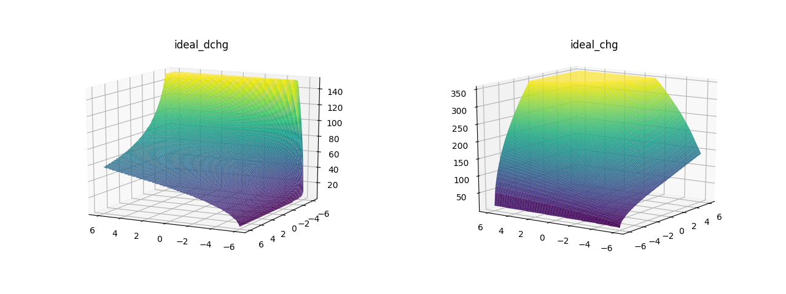

# ml_nlc
NLC table replacement based on ML

## Getting Started

To run most of the programs install the following dependencies:

- Python >= 3.5
- Tensorflow >= 2.3.0
- NumPy
- Matplotlib

Install [spfpm](https://pypi.org/project/spfpm/) to run the script for quantizing the Neural Network in Python via fixed point arithmetic.

### Linux

Install the python modules via pip:

> pip install tensorflow  
> pip install numpy  
> pip install matplotlib  
> pip install spfpm

## Project Directory Structure

### ReluNetwork

Contains everything to train a Neural Network via train\_network.py and run multiple tests for comparing different network sizes with test\_configurations.py.   quantize\_network.py trains a network, applies post-quantization (quantization aware training will follow) to it and saves it in the .tflite format.

### TrainingData

This includes both curves in .csv format and training\_data.py to load and process the training data.

### ReferenceImplementation

Loads the weights of an already trained network in .json format and runs the Neural Network in pure Python. Only dense layers are supported as of now.

### QuantizationScheme

A small reference implementation in C for the quantization scheme described here: [arXiv:1712.05877](https://arxiv.org/abs/1712.05877)